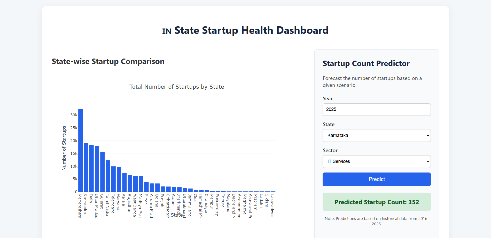

# 🇮🇳 State Startup Health Dashboard & Predictor  

📊 A full-stack data analytics application for **visualizing** and **forecasting** the Indian startup ecosystem.  

<div align="center">

<p>
  
  
  
  
  
  
</p>

</div>

---

## 📖 Table of Contents
- [🎯 About The Project](#-about-the-project)  
- [✅ Relevance for DPIIT Internship](#-relevance-for-dpiit-internship)  
- [✨ Key Features](#-key-features)  
- [🛠️ Tech Stack & Architecture](#-tech-stack--architecture)  
- [🚀 Getting Started](#-getting-started)  
  - [Prerequisites](#prerequisites)  
  - [Installation](#installation)  
  - [Running the Application](#running-the-application)  
- [🧠 ML Model Insights](#-ml-model-insights)  
- [🤝 Contributing](#-contributing)  

---

## 🎯 About The Project
This project is a **data-driven tool** designed to analyze the health of the Indian startup ecosystem.  

It tackles the challenge of **raw, fragmented government datasets** by building an **automated ETL pipeline** that structures the data into a PostgreSQL database.  

The application features an **interactive dashboard** that visualizes **state-wise startup density** and includes a **predictive machine learning model** to forecast startup counts.  

🔑 Initially planned for *funding prediction*, the project was **adapted to startup count prediction** due to data availability — demonstrating **problem-solving skills** in real-world data science.

---

## ✅ Relevance for DPIIT Internship
This project directly aligns with DPIIT internship domains:

- **Technology & Data Analytics**  
  - Full-stack dashboard built with Python, JS, Node.js, Express.  
  - Startup trends visualized for policy decisions.  

- **Startup & Innovation Ecosystem**  
  - Sector-wise startup analysis.  
  - Tool for entrepreneurship & regional growth research.  

- **Policy & Research**  
  - Prototype for industrial policy analysis.  
  - Enables exploration of **data-informed scenarios**.  

- **Economics & Finance**  
  - Predictive model contributes to research on industrial growth.  

---

## ✨ Key Features
- 🤖 **Automated ETL Pipeline** – Cleans & processes raw data into PostgreSQL.  
- 📊 **Interactive Dashboard** – Responsive visualizations with Plotly.js.  
- 🧠 **Predictive ML Model** – Random Forest regressor served via Flask API.  
- 🔗 **Microservice Architecture** – Decoupled Node.js API + Python ML service.  

---

## 🛠️ Tech Stack & Architecture

| Category          | Technologies |
|-------------------|--------------|
| **Frontend**      | HTML5, CSS3, JavaScript (ES6), Plotly.js |
| **Backend API**   | Node.js, Express.js |
| **ML Service**    | Python, Flask |
| **Database**      | PostgreSQL |
| **Data Science**  | Pandas, Scikit-learn |

**System Architecture**  
```
Client (Browser)
⬍
Express.js API ⬍ PostgreSQL
⬍
Flask ML Service
```
---

## 📸 Screenshots

### Dashboard – Statewise Startup Density  


---

## 🚀 Getting Started

### Prerequisites
- [Node.js](https://nodejs.org/) (v18+)  
- [Python](https://www.python.org/) (v3.8+)  
- [PostgreSQL](https://www.postgresql.org/)  

### Installation

1. **Clone the Repository**  
```bash
git clone https://github.com/abhijitreddy-06/startup-health-dashboard.git
cd startup-health-dashboard
```

2. **Setup PostgreSQL Database**
```sql
CREATE DATABASE startup_dashboard_db;
\c startup_dashboard_db
\i sql/schema.sql
```

3. **Setup Python Environment**
```bash
python -m venv venv
# On Windows
venv\Scripts\activate
# On macOS/Linux
source venv/bin/activate
pip install -r requirements.txt
```

4. **Run ETL Pipeline and Train Model**
```bash
python src/etl/etl_pipeline.py
python src/ml_service/model_train.py
```

5. **Setup Node.js API**
```bash
cd src/express_api
npm install
```

⚙️ **Configuration**  
Update database credentials in:
- `src/etl/etl_pipeline.py` (Python service)
- `src/express_api/routes/api.js` (Node.js API)

### Running the Application

**Terminal 1 – ML Service**
```bash
cd src/ml_service
python app.py
# Runs at: http://localhost:5001
```

**Terminal 2 – Node.js API**
```bash
cd src/express_api
npm start
# Runs at: http://localhost:5000
```

**Access Dashboard** → http://localhost:5000

---

## 🧠 ML Model Insights

**Model:** Random Forest Regressor  
**Objective:** Predict startup counts (2016–2025)  
**Features:** year, state, industry  
**Performance:** MAE ≈ 8.06 startups  

**Behavior:**
- ✅ Accurate interpolation within 2016–2025
- ⚠️ Cannot extrapolate beyond 2025 → predictions flatten

---

## 🤝 Contributing

Contributions are welcome! 🎉

1. Fork the repo
2. Create your branch (`git checkout -b feature/xyz`)
3. Commit changes (`git commit -m 'Add feature xyz'`)
4. Push to branch (`git push origin feature/xyz`)
5. Open a Pull Request

---

<div align="center">

Made with ❤️ for the Indian Startup Ecosystem

</div>
